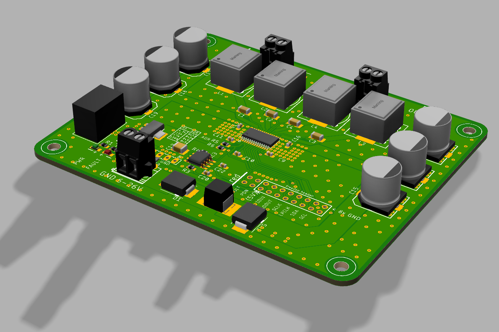
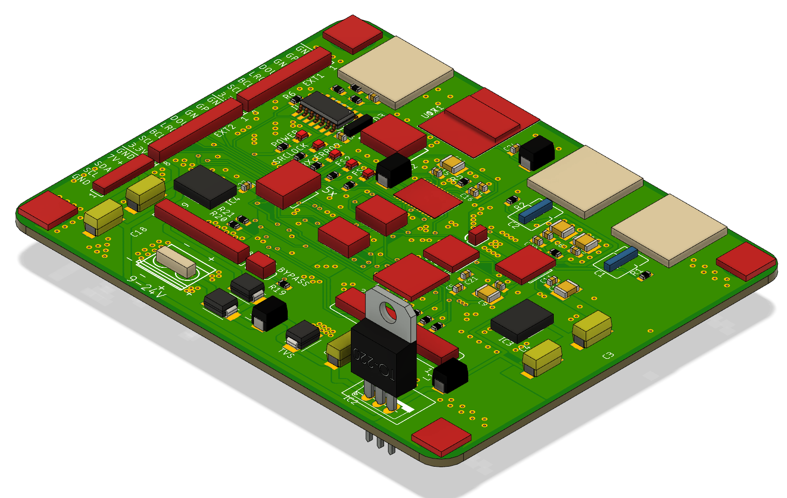

# mbAMP2

A fully digital audio amplifier.



## Status

Updates towards Version v02
* Removed Pi Header - to much space
* Added 4 extra pins to the FreeDSP header (PowerDown, Fault)
* Added power polarity overvoltage overcurrent protection.
* Added Voltage drop detection for clean/krackless shutdown. (to be tested)

## Todo

* order

## Minimum Startup Code

The chip needs some I2C talking to start up.

You will also need some kind of I2S data source, e.g. Teensy Audio, some china ADC or SPDIF receiver or my AMP2-IO the do it all solution, see below.

```
bool Tas5805m::begin()
{
    Wire.begin();
    write(DEVICE_CTRL_2, 0x02);  // HiZ
    delay(5);
    write(DEVICE_CTRL_2, 0x03);  // Play
}
void Tas5805m::write(byte reg, byte data)
{
    Wire.beginTransmission(_adr);
    Wire.write(reg);
    Wire.write(data);
    byte result = Wire.endTransmission();
    logerror(result, reg);
}
```

[My TAS5805m repo](https://github.com/mariosgit/TAS58xx) contains more examples how to use the thing.

# mbAMP2-IO Board

Input board with Sampe Rate Converter, ADC, SPDIF...



## Status

Not tested, in development.

* works on breadboard.

## Todo

* move to own repo.
* more 3D on the rendering.

## Issues 1.0rc1

* fuse solder mask blocker to be wider -> wrong, added rectangles for signals, done.
* move 6.5V reg right out of the ribbon caple way, done.

# License

#### Attribution-NonCommercial-ShareAlike - CC BY-NC-SA

```
Attribution — You must give appropriate credit, provide a link to the license, and indicate if changes were made. You may do so in any reasonable manner, but not in any way that suggests the licensor endorses you or your use.

NonCommercial — You may not use the material for commercial purposes.

ShareAlike — If you remix, transform, or build upon the material, you must distribute your contributions under the same license as the original.

No additional restrictions — You may not apply legal terms or technological measures that legally restrict others from doing anything the license permits.
```
[All the legal blabla here](https://creativecommons.org/licenses/by-nc-sa/4.0/legalcode)
